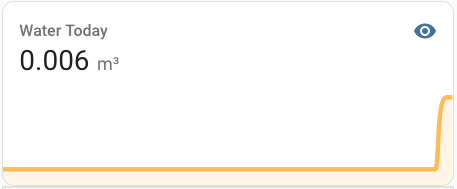

# Reading Kamstrup [Multical 21 Watermeter](https://www.kamstrup.com/da-dk/vandloesninger/intelligente-vandmaalere/meters/multical-21) using [AI-on-the-edge-device](https://github.com/jomjol/AI-on-the-edge-device)

There are a few option to how one can read the values off the [Kamstrup Multical 21](https://www.kamstrup.com/da-dk/vandloesninger/intelligente-vandmaalere/meters/multical-21), all of them work (mostly):

- mbus
    - you'll need an encryption key and not all utilities will hand them out. In Denmark where I live, they use GDRP to block access (bugger) More about it here [Support for reading Multical 21 water meters](https://community.home-assistant.io/t/support-for-reading-multical-21-water-meters/484343), well it is a start.
- ir
    - that might work, it might not. Someone found that the IR shuts down after 5 connections and will then come back to life after 12 hours (bugger). More about it here [[REQUEST] Water flow metering reading of IEC 62056-21 protocol smart water meters via photodiode/infrared optical eye reader header?](https://github.com/esphome/feature-requests/issues/1402#issuecomment-1531304437), 
- using a camera to read take a photo ([AI-on-the-edge-device](https://github.com/jomjol/AI-on-the-edge-device))
    - that will work, but it is more work and not as fun as using either of the two other option.


## What you need as per [AI-on-the-edge-device](https://github.com/jomjol/AI-on-the-edge-device):
- ESP32 Cam module (ask [Google](http://www.google.com))
    - a way to power it. I took an old USB cable, and connected the RED and WHITE wire to VCC and GND respectably. Worked like a charm.
- SD Card (not larger than 16GB, 4 or 8 will be fine)
- a 3d Printer or access to one.
    - you to be able create a mount, which places the camera approx. 10 cm above the surface of the meter. 
    - I used this [ESP32-cam mount for Kamstrup Multical 21](https://www.printables.com/en/model/551523-kamstrup-multical-21-ai-on-the-edge), I had to enlarge it with 2.22% for it to fit ontop of my meter. The meter is 92mm in diameter, on my Ender-3 v3 SE, using PLA it was printed messuring 90mm.

That is all the easy part.

## Initial Configuration of the module

1. Using a FTDI or USB ESP32-Camera-Mount to connect the ESP32-Cam module to your computer.
2. Use the [Webinstaller and Console](https://jomjol.github.io/AI-on-the-edge-device/index.html) to upload the latest version of the AI firmware, remember to use Google Chrome or Edge.
3. Format the SD-Card as a FAT device (!!not ex-fat).
4. Copy the content of [sd-card](https://github.com/jomjol/AI-on-the-edge-device/tree/rolling/sd-card) to the root of the SD-Card. 
5. You can choose to access the WLAN provided by the module (default), which is **"AI-on-the-edge"**, then access the module to setup Wifi.
Or you can modify the wlan.ini at the root of the SD-Card.
6. Then you need to do the configuration....

I would highly recommend to add NTP settings, otherwise it will report to have read the values in 1970. This is done manually in the config.ini.

## Configurating the AI ..
Follow the documentation from [AI-on-the-edge-device](https://github.com/jomjol/AI-on-the-edge-device) to do the initial configuration.

I have a Multical 21 which have the "liters" in superscript, which makes it a bit more combersom.

[](multical21_reference_image.png)

I have digits 1-6, getting them right took some time (lots of it actually, in config.ini it is like:

```ini
[Digits]
Model = /config/dig-class100-0168_s2_q.tflite
CNNGoodThreshold = 0.5
main.dig1 252 48 50 103 0
main.dig2 295 48 50 103 0
main.dig3 338 48 50 103 0
main.dig4 384 61 24 51 0
main.dig5 405 61 24 51 0
main.dig6 427 61 24 51 0
```
In addition, to seperate liters from m3 I have this:


```ini
[PostProcessing]
main.DecimalShift = -3
```

The JSON result in MQTT:
```json
  {
    "value": "352.251",
    "raw": "352.251",
    "pre": "352.251",
    "error": "no error",
    "rate": "0.000000",
    "timestamp": "2024-03-09T16:01:52+0100"
  }

```

352 M3, 251 Liters (I do not know how people in the US would do this, they probably would convert it to Olympic swimmingpools)


## Home Assistant

I am still working on this part, I hvae the value but I (as usual have some headacke with this).

#### To get the values into HA add this to your configuration.yaml or sensors.yaml (you'll know):

This is from [AI-on-the-edge-device](https://github.com/jomjol/AI-on-the-edge-device/wiki/Integration-Home-Assistant) and here: [https://community.home-assistant.io/t/ai-solution-for-analog-water-meter/378457/12](https://community.home-assistant.io/t/ai-solution-for-analog-water-meter/378457/12)

```yaml
mqtt:
  sensor:
    - state_topic: "watermeter/main/value"
      name: "Watermeter Value"
      unique_id: watermeter_value
      unit_of_measurement: 'm³'
      state_class: total_increasing
      device_class: water # Needs Home Assistant 2022.11!
      icon: 'mdi:water-pump'
      availability_topic: watermeter/connection
      payload_available: connected
      payload_not_available: connection lost

    - state_topic: "watermeter/main/rate"
      name: "Watermeter Rate"
      unique_id: watermeter_rate
      unit_of_measurement: 'm³/min'
      state_class: measurement
      device_class: water # Needs Home Assistant 2022.11!
      icon: 'mdi:water-pump'
      availability_topic: watermeter/connection
      payload_available: connected
      payload_not_available: connection lost

    - state_topic: "watermeter/main/error"
      name: "Watermeter Error"
      unique_id: watermeter_error
      icon: "mdi:water-alert"
      availability_topic: watermeter/connection
      payload_available: connected
      payload_not_available: connection lost    

    - state_topic: "watermeter/main/json"
      name: "Watermeer JSON"
      unique_id: watermeter_json
      availability_topic: watermeter/connection
      payload_available: connected
      payload_not_available: connection lost

    - state_topic: "watermeter/uptime"
      name: "Watermeter Uptime"
      unique_id: watermeter_uptime
      unit_of_measurement: 's'
      state_class: measurement
      device_class: duration
      entity_category: diagnostic
      icon: "mdi:timer-outline"
      availability_topic: watermeter/connection
      payload_available: connected
      payload_not_available: connection lost
```

#### So far so good, then add this to get more informaiton about the usage:

```yaml
utility_meter:
  quaterhour_water:
    source: sensor.watermeter_value
    cycle: quarter-hourly
    tariffs:
      - peak
  daily_water:
    source: sensor.watermeter_value
    cycle: daily
    tariffs:
      - peak
  monthly_water:
    source: sensor.watermeter_value
    tariffs:
      - peak
```

### In add this to your dashboard

```yaml
type: vertical-stack
cards:
  - hours_to_show: 24
    graph: line
    type: sensor
    entity: sensor.daily_water_peak
    detail: 2
    name: Water Today
```

**That will give you a nice graph**<br/>
[](water-today.png)


<br/>

# Work in progress

I am still working on getting the information into the "Energy" dashbard, but I am not happy with how it is ... more later. 


